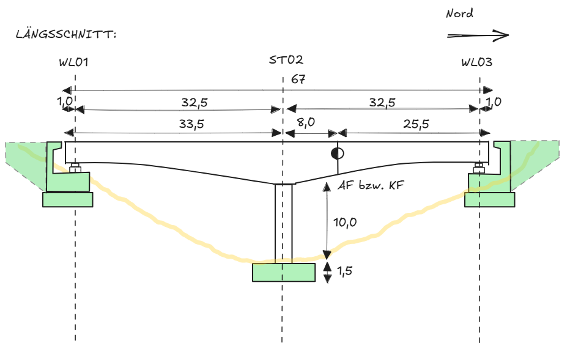
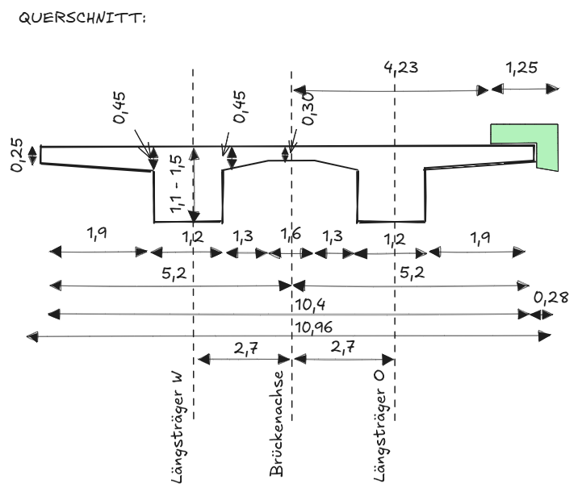
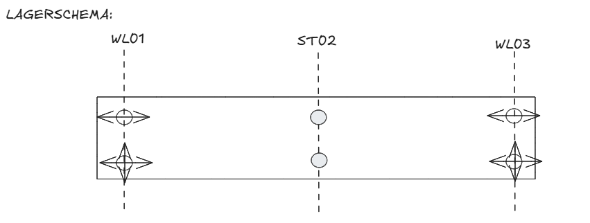
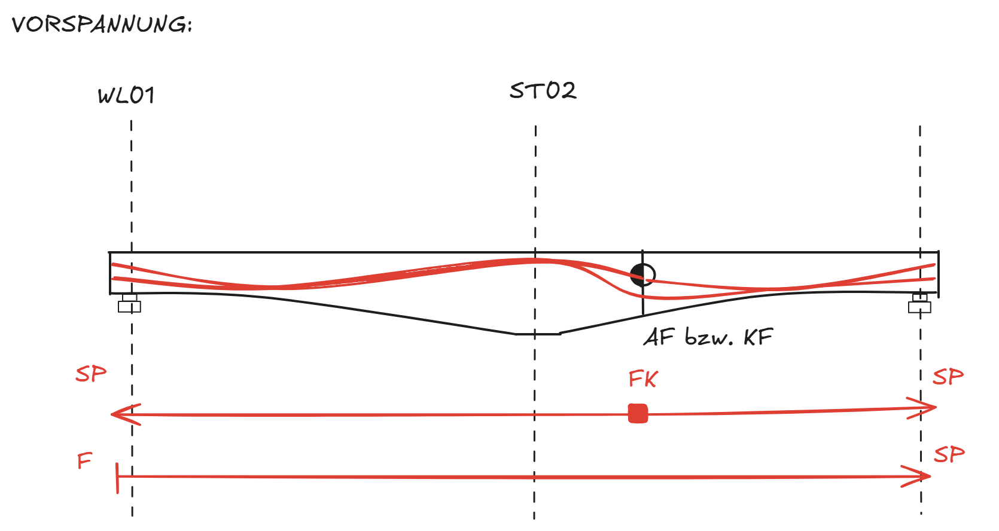
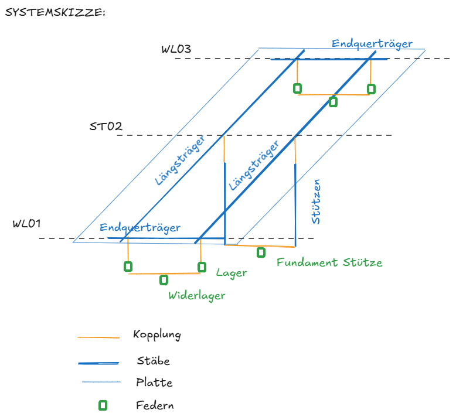

Es wird eine 2-Feld Brücke mit folgenden Merkmalen modelliert:
- Doppelter Plattenbalkenquerschnitt
- veränderliche Überbauhöhe
- Arbeitsfuge / Koppelfuge im zweiten Feld
- Semi-integral: Lager an den Widerlagern und monolithische Anschluss an die Stützen
- Fahrbahnplatte wird als orthotrope Platte berücksichtigt

Längsschnitt der Brücke:

Charakteristische Querschnitt:

Lagerschema:

Spanngliedschema:

SP: Spannanker
FK: Feste Kopplung
F: Festanker

In der folgenden Skizze ist das statische System, das modelliert wird, abgebildet:

