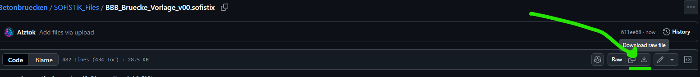
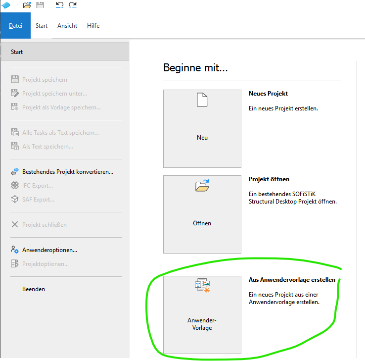
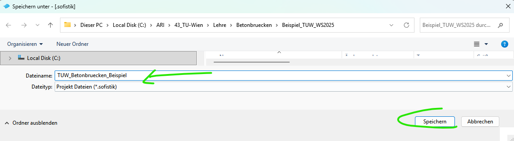

# Erstellen-des-Projekts

Das Projekt wird mithilfe einer Anwendervorlage erstellt.

Die Anwendervorlage kann hier heruntergeladen werden:
[Anwendervorlage herunterladen](https://github.com/AIztok/Betonbruecken/blob/main/SOFiSTiK_Files/BBB_Bruecke_Vorlage_v00.sofistix)

Download raw file, dann wird die .sofistix Datei lokal gespeichert:

In der Anwendervorlage wurde bereits eine Basisstruktur fürs Projekt erstellt. Diese sollte alle Übungen im Rahmen der LVA abdecken. Die Aufteilung und Nummerierung basiert auf Erfahrung des Autors in seiner Praxisarbeit, kann aber natürlich angepasst werden. Wesentlich hier ist, dass man eine Struktur findet, die bei meisten Projekten anwendbar ist.

Im SSD auswählen `Aus Anwendervorlage erstellen`:

Den Namen der Sofistik-Datei angeben und speichern:

Danach öffnet sich die Datei mit dem aus der Vorlage definiertem Baum von Gruppen und Tasks:

